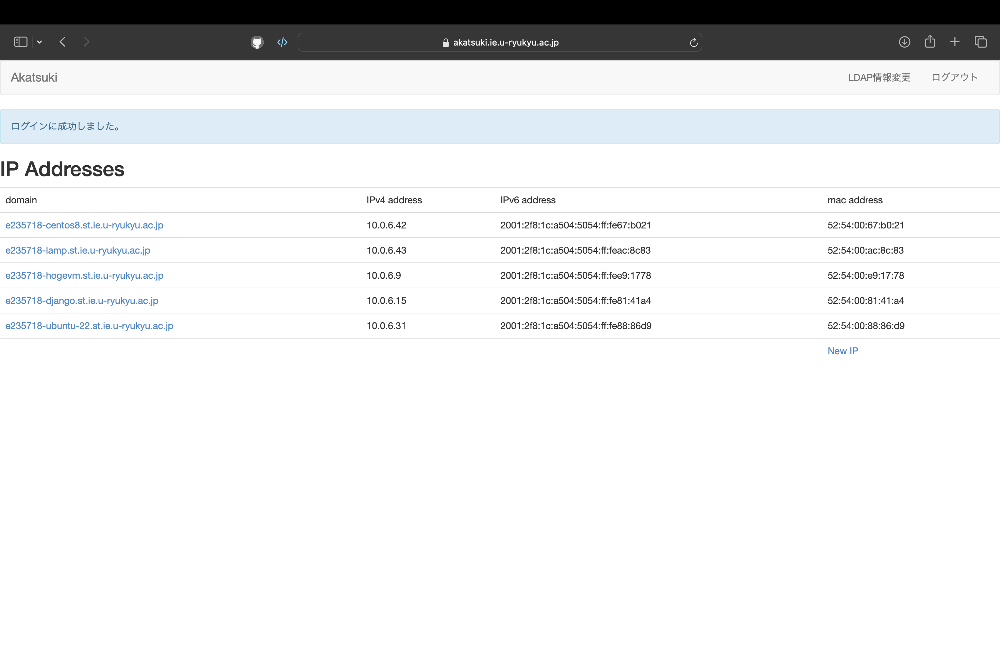
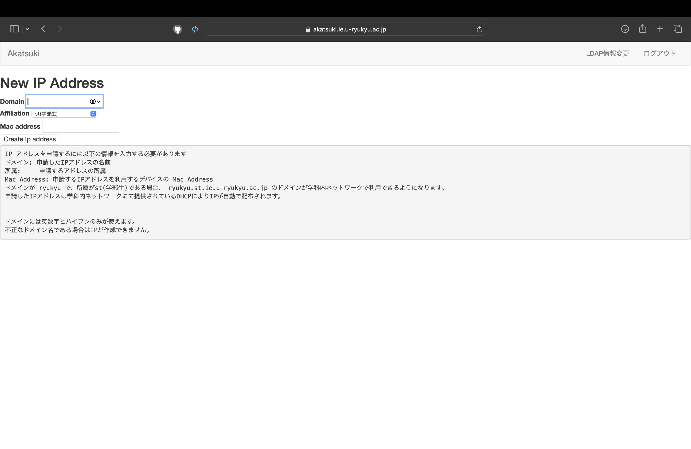

# 学科サーバー上でLinux環境構築
### Author: [IbukiShinzato](https://github.com/IbukiShinzato)

学科サーバー(amane)でie-virshコマンド使いVMを作成

https://ie.u-ryukyu.ac.jp/syskan/service/ie-virsh/ に詳しく書かれています。


## amaneにログイン
公開鍵認証でログインする

鍵の作成
```
❯ ssh-keygen
```

`-t`や`-f`で鍵の種類や名前を設定することも可能

デフォルトだと`id_ed25519.pub`と`id_ed25519`が作られる。

鍵の確認
```
❯ ls
conf-ie  config  hb-intern-202408.pem  id_ed25519  id_ed25519.pub  id_rsa  id_rsa.pub  known_hosts  known_hosts.old
```

それぞれが存在するのを確認したら、`config`ファイルに以下のように記述する。`config`ファイルがなかったら作成して記入。

config
```
 Host amane
  IdentityFile ~/.ssh/秘密鍵の名前
  HostName amane.ie.u-ryukyu.ac.jp
  User '自分のユーザー名'
  Port 1322
  AddressFamily inet
```

amaneに公開鍵を転送
```
❯ ssh-copy-id -i 公開鍵 ユーザー名@amane.ie.u-ryukyu.ac.jp
```

amaneにログイン
```
❯ ssh amane
```

ログイン完了後は以下のようになっている。`e235718`のところは登録したユーザー名になっていれば良い。
```
e235718@amane:~$ 
```

## VMの作成
`ie-virsh`コマンドを使ってVMを操作する。

`ie-virsh` とコマンドを打つとコマンドの説明が出るからこれを参考にすると良い。

```
e235718@amane:~$ ie-virsh
ie-virsh 0.2.4
AnaTofuZ <anatofuz@cr.ie.u-ryukyu.ac.jp>

USAGE:
    ie-virsh <SUBCOMMAND>

FLAGS:
    -h, --help       Prints help information
    -V, --version    Prints version information

SUBCOMMANDS:
    attach-disk     attach-disk 03 /home/open/Fedora/....iso
    change-media    change media [--eject|...]
    console         connect to the guest console
    define          define (but don't start) a domain from an template XML file
    destroy         destroy (stop) a domain
    domiflist       list all domain virtual interfaces
    dominfo         domain information
    dumpxml         domain information in XML
    edit            edit XML configuration for a domain
    help            Prints this message or the help of the given subcommand(s)
    list            list domains
    shutdown        gracefully shutdown a domain
    start           start a (previously defined) inactive domain
    templates       show templates vm
    ttyconsole      tty console
    undefine        undefine a domain
    vncdisplay      vncdisplay
```

### OSの決定
`ie-virsh templates`で使えるOSの一覧を表示することができる。

使えるOSは様々あるが、最初は`Ubuntu-22`をおすすめする。

```
e235718@amane:~$ ie-virsh templates
uid: 19042 gid: 1001 name: e235718
CentOS-7
CentOS-8
Debian-10
Debian-8
Fedora33-Debug
Fedora36-Debug
Fedore-25
GNS3VM
Ubuntu-16
Ubuntu-18
Ubuntu-20
Ubuntu-22
aarch-ubuntu22
manjaro-kde
manjaro-minimal
```

以下のコマンドでVMを作成する。

使用OS: Ubuntu(20.04)
```
e235718@amane:~$ ie-virsh define -b makevm -t Ubuntu-20
uid: 19042 gid: 1001 name: e235718
e235718-makevm
generate xml : /etc/libvirt/qemu/e23/e235718/e235718-makevm.xml
vnc password : K47dq~S(
Formatting 'e235718-makevm.qcow2', fmt=qcow2 cluster_size=65536 extended_l2=off compression_type=zlib size=10737418240 backing_file=/ie-ryukyu/kvm/images/templates/template-Ubuntu-20.qcow2 backing_fmt=qcow2 lazy_refcounts=off refcount_bits=16
initial user is xxxxxxxx
initial password is xxxxxxx
Domain 'e235718-makevm' defined from /etc/libvirt/qemu/e23/e235718/e235718-makevm.xml
```

ここで出力されたものをメモに残しておいてください。
VMにログインする際に使用します。

`ie-virsh list`でVMが作られているか確認
```
e235718@amane:~$ ie-virsh list
uid: 19042 gid: 1001 name: e235718
 Id    Name                            State
-------------------------------------------------
 562   e235718-Ubuntu-22               running
 -     e235718-centos8                 shut off
 -     e235718-lamp                    shut off
 -     e235718-makevm                  shut off
```

make-vmがあるので、作成できたことがわかる。

### VMにIPアドレスを割り振る
VMにログインする際にIPアドレスが必要になります。
そのため、[Akatuki](https://akatsuki.ie.u-ryukyu.ac.jp)を使ってVMにIPアドレスを割り振ります。

Akatukiにログインしたら、`New IP`をクリックします。




`Domain`には自分のユーザー名と`ie-virsh define`の-bで指定した名前を入れる。

ここでは`e235718-makevm`となる。

`Mac address`には以下のコマンドで出力されるMACとなる
```
e235718@amane:~$ ie-virsh domiflist makevm
uid: 19042 gid: 1001 name: e235718
 Interface   Type     Source   Model    MAC
-----------------------------------------------------------
 -           bridge   br62     virtio   52:54:00:1e:39:4a
```

ここでは`52:54:00:1e:39:4a`となる。

どちらも入力できたら、`Create Ip address`をクリック



`Create Ip address`をクリック後に`IPv4 address`が割り振られているので、これを使って`amane`からログインしてみる。

VMを起動してログイン
```
e235718@amane:~$ ie-virsh list
uid: 19042 gid: 1001 name: e235718
 Id    Name                            State
-------------------------------------------------
 562   e235718-Ubuntu-22               running
 -     e235718-centos8                 shut off
 -     e235718-lamp                    shut off
 -     e235718-makevm                  shut off
e235718@amane:~$ ie-virsh start makevm
uid: 19042 gid: 1001 name: e235718
Domain 'e235718-makevm' started

e235718@amane:~$ ie-virsh list
uid: 19042 gid: 1001 name: e235718
 Id    Name                            State
-------------------------------------------------
 562   e235718-Ubuntu-22               running
 571   e235718-makevm                  running
 -     e235718-centos8                 shut off
 -     e235718-lamp                    shut off
e235718@amane:~$ ssh ユーザ名@10.0.3.150
The authenticity of host '10.0.3.150 (10.0.3.150)' can't be established.
ED25519 key fingerprint is SHA256:dnKJDSGb2RbxL6TK8NvH2pB52RrCPsrBjv3rtQFpkJ4.
This host key is known by the following other names/addresses:
    ~/.ssh/known_hosts:3: [hashed name]
    ~/.ssh/known_hosts:4: [hashed name]
    ~/.ssh/known_hosts:14: [hashed name]
    ~/.ssh/known_hosts:16: [hashed name]
    ~/.ssh/known_hosts:19: [hashed name]
Are you sure you want to continue connecting (yes/no/[fingerprint])? yes
Warning: Permanently added '10.0.3.150' (ED25519) to the list of known hosts.
ユーザ名@10.0.3.150's password: 
Welcome to Ubuntu 20.04.1 LTS (GNU/Linux 5.4.0-42-generic x86_64)

 * Documentation:  https://help.ubuntu.com
 * Management:     https://landscape.canonical.com
 * Support:        https://ubuntu.com/advantage


0 updates can be installed immediately.
0 of these updates are security updates.


The list of available updates is more than a week old.
To check for new updates run: sudo apt update
Last login: Wed Aug 26 16:27:14 2020 from 10.100.10.50
ユーザ名@ubuntu:~$ 
```

ここでのユーザ名とパスワードは、先ほどメモしておくように言ったものを使用します。

ユーザ名@ubuntu:~$となっていればログインは完了です。

現在はパスワード認証であるのと、デフォルトのユーザーでのログインなので、公開鍵認証にしたり、ユーザーを作成すると良いでしょう。

